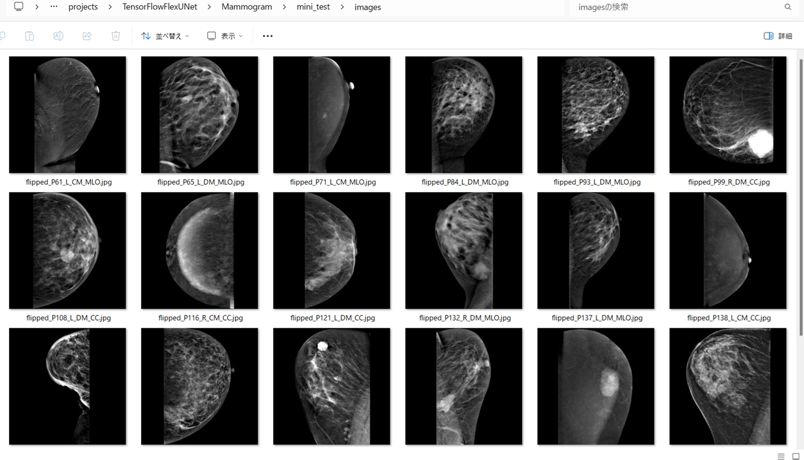
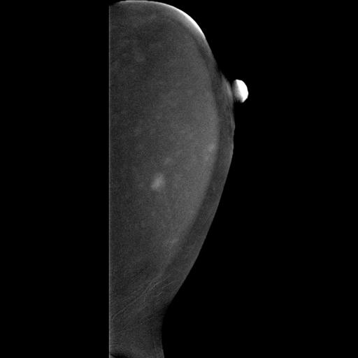

<h2>TensorFlow-FlexUNet-Image-Segmentation-CDD-CESM-Mammogram (2025/06/12)</h2>

This is the first experiment of Image Segmentation for CDD-CESM-Mammogram (Benign and Malignant)
 based on 
our <a href="./src/TensorFlowFlexUNet.py">TensorFlowFlexUNet</a>
 (<b>TensorFlow Flexible UNet Image Segmentation Model for Multiclass</b>) and an
 <a href="https://drive.google.com/file/d/1d8AXGvjWbDP2MIKVXNLWlq5__OhhsGuT/view?usp=sharing">
Augmented-CDD-CESM-Mammogram-ImageMask-Dataset.zip</a>, which was derived by us from the 
<a href="https://wiki.cancerimagingarchive.net/pages/viewpage.action?pageId=109379611#109379611bcab02c187174a288dbcbf95d26179e8">
Categorized Digital Database for Low energy and Subtracted Contrast Enhanced Spectral Mammography images (CDD-CESM)</a>
 
 

<b>Actual Image Segmentation for 512x512 Mammogram Dataset</b> 
As shown below, the inferred masks look similar to the ground truth masks.  
In the following predicted mask images, green regions indicate benign areas, while red regions indicate malignant tumors. 
 
<table>
<tr>
<th>Input: image</th>
<th>Mask (ground_truth)</th>
<th>Prediction: inferred_mask</th>
</tr>
<tr>
<td></td>
<td></td>
<td></td>
</tr>

<tr>
<td></td>
<td></td>
<td></td>
</tr>

<tr>
<td></td>
<td></td>
<td></td>
</tr>
</table>

 
<b>1. Dataset Citation</b> 
The image dataset used here has been taken from the following web site. 
<a href="https://wiki.cancerimagingarchive.net/pages/viewpage.action?pageId=109379611#109379611bcab02c187174a288dbcbf95d26179e8">
Categorized Digital Database for Low energy and Subtracted Contrast Enhanced Spectral Mammography images (CDD-CESM)</a>
 
 
<b>Citations & Data Usage Policy</b> 
Users must abide by the TCIA Data Usage Policy and Restrictions. Attribution should include references  
to the following citations: 
 
<b>Data Citation</b> 
Khaled R., Helal M., Alfarghaly O., Mokhtar O., Elkorany A., El Kassas H., Fahmy A. Categorized Digital Database 
for Low energy and Subtracted Contrast Enhanced Spectral Mammography images [Dataset]. (2021) The Cancer Imaging 
Archive. DOI:  10.7937/29kw-ae92 
 

<b>Publication Citation</b>
Khaled, R., Helal, M., Alfarghaly, O., Mokhtar, O., Elkorany, A., El Kassas, H., & Fahmy, A. Categorized contrast 
enhanced mammography dataset for diagnostic and artificial intelligence research. (2022) Scientific Data, 
Volume 9, Issue 1. DOI: 10.1038/s41597-022-01238-0 
 

<b>TCIA Citation</b> 
Clark K, Vendt B, Smith K, Freymann J, Kirby J, Koppel P, Moore S, Phillips S, Maffitt D, Pringle M, Tarbox L, 
Prior F. The Cancer Imaging Archive (TCIA): Maintaining and Operating a Public Information Repository, 
Journal of Digital Imaging, Volume 26, Number 6, December, 2013, pp 1045-1057. DOI: 10.1007/s10278-013-9622-7 
 
<h3>
<a id="2">
2 Mammogram ImageMask Dataset
</a>
</h3>
 If you would like to train this Mammogram Segmentation model by yourself,
 please download the dataset from the google drive  
 <a href="https://drive.google.com/file/d/1d8AXGvjWbDP2MIKVXNLWlq5__OhhsGuT/view?usp=sharing">
Augmented-CDD-CESM-Mammogram-ImageMask-Dataset.zip</a>
, expand the downloaded ImageMaskDataset and put it under <b>./dataset</b> folder to be
<pre>
./dataset
└─Mammogram
    ├─test
    │   ├─images
    │   └─masks
    ├─train
    │   ├─images
    │   └─masks
    └─valid
        ├─images
        └─masks
</pre>
 
<b>Mammogram Statistics</b> 
 
 
As shown above, the number of images of train and valid datasets is not so large to use for the
 training set of our segmentation model.
 
 
<b>Train_images_sample</b> 

 
<b>Train_masks_sample</b> 

 

<h3>
3 Train TensorFlowFlexUNet Model
</h3>
 We trained Mammogram TensorFlowFlexUNet Model by using the following
<a href="./projects/TensorFlowFlexUNet/Mammogram/train_eval_infer.config"> <b>train_eval_infer.config</b></a> file.  
Please move to ./projects/TensorFlowFlexUNet/Mammogram and run the following bat file. 
<pre>
>1.train.bat
</pre>
, which simply runs the following command. 
<pre>
>python ../../../src/TensorFlowFlexUNetTrainer.py ./train_eval_infer.config
</pre>

<b>Model parameters</b> 
Defined a small <b>base_filters = 16 </b> and large <b>base_kernels = (9,9)</b> for the first Conv Layer of Encoder Block of 
<a href="./src/TensorFlowFlexUNet.py">TensorFlowFlexUNet.py</a> 
and a large num_layers (including a bridge between Encoder and Decoder Blocks).
<pre>
[model]
;You may specify your own UNet class derived from our TensorFlowFlexModel
model         = "TensorFlowFlexUNet"
generator     =  False
image_width    = 512
image_height   = 512
image_channels = 3
num_classes    = 3

base_filters   = 16
base_kernels   = (7,7)
num_layers     = 8
dropout_rate   = 0.04
dilation       = (1,1)
</pre>
<b>Learning rate</b> 
Defined a small learning rate.  
<pre>
[model]
learning_rate  = 0.00007
</pre>
<b>Loss and metrics functions</b> 
Specified "categorical_crossentropy" and <a href="./src/dice_coef_multiclass.py">"dice_coef_multiclass"</a>. 
<pre>
[model]
loss           = "categorical_crossentropy"
metrics        = ["dice_coef_multiclass"]
</pre>
<b>Dataset class</b> 
Specifed <a href="./src/ImageCategorizedMaskDataset.py">ImageCategorizedMaskDataset</a> class. 
<pre>
[dataset]
class_name    = "ImageCategorizedMaskDataset"
</pre>
 
<b>Learning rate reducer callback</b> 
Enabled learing_rate_reducer callback, and a small reducer_patience.
<pre> 
[train]
learning_rate_reducer = True
reducer_factor     = 0.4
reducer_patience   = 4
</pre>
<b>Early stopping callback</b> 
Enabled early stopping callback with patience parameter.
<pre>
[train]
patience      = 10
</pre>

<b>RGB Color map</b> 
Specifed rgb color map dict for Mammogram 3 classes. 
<pre>
[mask]
mask_datatype= "categorized"
mask_file_format = ".png"
;Mammogram rgb color map dict for 1+2 classes.
;        background:black , Benign:green  Malignant: red
rgb_map = {(0,0,0):0,(0,255,0):1, (255,0,0):2 }
</pre>

<b>Epoch change inference callback</b> 
Enabled <a href="./src/EpochChangeInferencer.py">epoch_change_infer callback</a></b>. 
<pre>
[train]
epoch_change_infer       = True
epoch_change_infer_dir   =  "./epoch_change_infer"
num_infer_images         = 6
</pre>

By using this callback, on every epoch_change, the inference procedure can be called
 for 6 images in <b>mini_test</b> folder. This will help you confirm how the predicted mask changes 
 at each epoch during your training process.  
  
As shown below, early in the model training, the predicted masks from our UNet segmentation model showed 
discouraging results.
 However, as training progressed through the epochs, the predictions gradually improved. 
   
 
<b>Epoch_change_inference output at starting (epoch 1,2,3)</b> 
 
 
<b>Epoch_change_inference output at middlepoint (epoch 20,21,22)</b> 
 
 

<b>Epoch_change_inference output at ending (epoch 42,43,44)</b> 
 
 

In this experiment, the training process was stopped at epoch 44 by EarlyStopping callback.  
 
 

<a href="./projects/TensorFlowFlexUNet/Mammogram/eval/train_metrics.csv">train_metrics.csv</a> 
 

 
<a href="./projects/TensorFlowFlexUNet/Mammogram/eval/train_losses.csv">train_losses.csv</a> 
 

 

<h3>
4 Evaluation
</h3>
Please move to <b>./projects/TensorFlowFlexUNet/Mammogram</b> folder, 
and run the following bat file to evaluate TensorFlowUNet model for Mammogram. 
<pre>
./2.evaluate.bat
</pre>
This bat file simply runs the following command.
<pre>
python ../../../src/TensorFlowFlexUNetEvaluator.py ./train_eval_infer_aug.config
</pre>

Evaluation console output: 

  Image-Segmentation-Mammogram

<a href="./projects/TensorFlowFlexUNet/Mammogram/evaluation.csv">evaluation.csv</a> 
The loss (categorical_crossentropy) to this Mammogram/test was not low, and dice_coef_multiclass 
was high as shown below.
 
<pre>
categorical_crossentropy,0.1221
dice_coef_multiclass,0.9467
</pre>
 

<h3>
5 Inference
</h3>
Please move to a <b>./projects/TensorFlowFlexUNet/Mammogram</b> folder 
,and run the following bat file to infer segmentation regions for images by the Trained-TensorFlowUNet model for Mammogram. 
<pre>
./3.infer.bat
</pre>
This simply runs the following command.
<pre>
python ../../../src/TensorFlowFlexUNetInferencer.py ./train_eval_infer_aug.config
</pre>
<!--
They should ideally be smoother.
 -->
 
 

<b>mini_test_images</b> 
 
<b>mini_test_mask(ground_truth)</b> 
 

<b>Inferred test masks</b> 
 
 

<b>Enlarged images and masks of 512x512 pixels</b> 
As shown below, the predicted masks for the green benign areas by this <b>simple</b> semgentation model
were unsatifactory results. However, there might be a slight issue with the annotation of the mask (label) images 
in this segmentation dataset. Specifically, some polygons representing the benign regions appear unnaturally angular.

<table>
<tr>
<th>Image</th>
<th>Mask (ground_truth)</th>
<th>Inferred-mask</th>
</tr>
<tr>
<td></td>
<td></td>
<td></td>
</tr>

<tr>
<td></td>
<td></td>
<td></td>
</tr>

<tr>
<td></td>
<td></td>
<td></td>
</tr>

<tr>
<td></td>
<td></td>
<td></td>
</tr>

<tr>
<td></td>
<td></td>
<td></td>
</tr>

<tr>
<td></td>
<td></td>
<td></td>
</tr>
</table>

 
<h3>
References
</h3>
<b>1. Categorized Digital Database for Low energy and Subtracted Contrast Enhanced Spectral Mammography images (CDD-CESM)
</b> 
<a href="https://wiki.cancerimagingarchive.net/pages/viewpage.action?pageId=109379611#109379611bcab02c187174a288dbcbf95d26179e8">
https://wiki.cancerimagingarchive.net/pages/viewpage.action?pageId=109379611#109379611bcab02c187174a288dbcbf95d26179e8
</a>
 
 
<b>2. Categorized contrast enhanced mammography dataset for diagnostic and artificial intelligence research
</b> 
Rana Khaled, Maha Helal, Omar Alfarghaly, Omnia Mokhtar, Abeer Elkorany, 
Hebatalla El Kassas & Aly Fahmy 
<a href="https://www.nature.com/articles/s41597-022-01238-0">
https://www.nature.com/articles/s41597-022-01238-0
</a>
 
 
<b>3. CDD-CESM-Dataset</b> 
<a href="https://github.com/omar-mohamed/CDD-CESM-Dataset">
https://github.com/omar-mohamed/CDD-CESM-Dataset
</a>
 
 
<b>4. Breast Cancer Segmentation Methods: Current Status and Future Potentials</b> 
Epimack Michael, He Ma, Hong Li, Frank Kulwa, and Jing 
<a href="https://www.ncbi.nlm.nih.gov/pmc/articles/PMC8321730/">
https://www.ncbi.nlm.nih.gov/pmc/articles/PMC8321730/
</a>
 
 
<b>5. Tensorflow-Image-Segmentation-CDD-CESM-Mammogram</b> 
Toshiyuki Arai @antillia.com 
<a href="https://github.com/sarah-antillia/Tensorflow-Image-Segmentation-CDD-CESM-Mammogram">

https://github.com/sarah-antillia/Tensorflow-Image-Segmentation-CDD-CESM-Mammogram
</a>
 
 

<b>6. TensorflowEfficientUNet-Segmentation-CDD-CESM-Mammogram</b> 
Toshiyuki Arai @antillia.com 

<a href="https://github.com/sarah-antillia/TensorflowEfficientUNet-Segmentation-CDD-CESM-Mammogram">
https://github.com/sarah-antillia/TensorflowEfficientUNet-Segmentation-CDD-CESM-Mammogram
</a>

